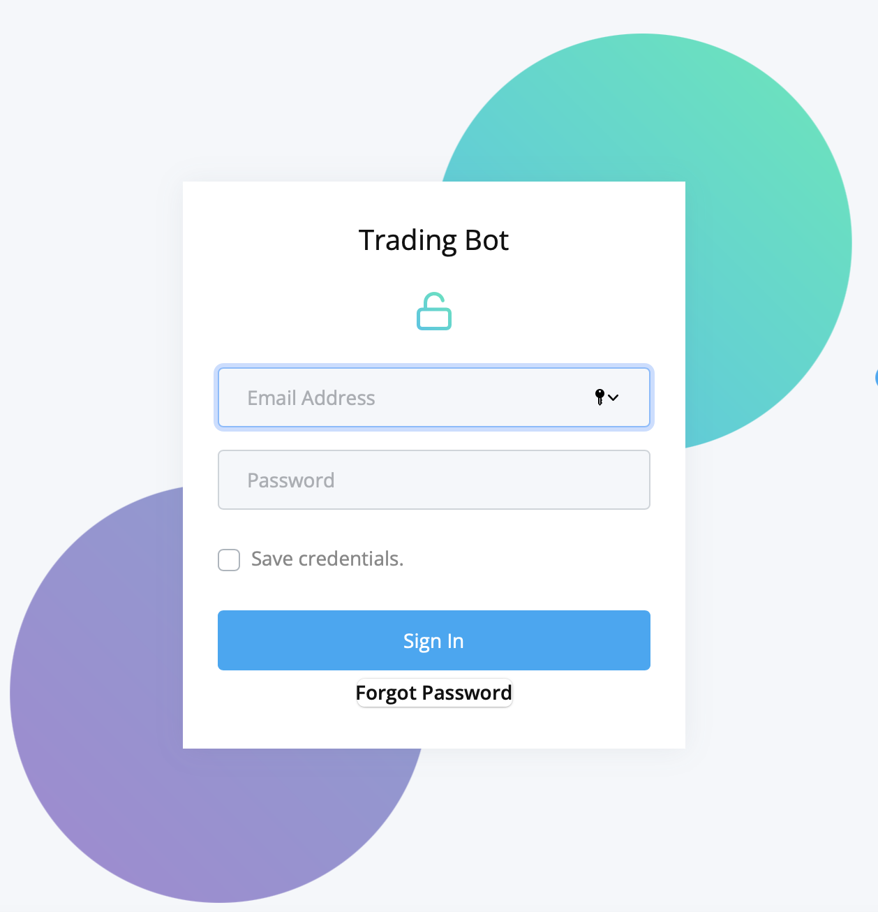
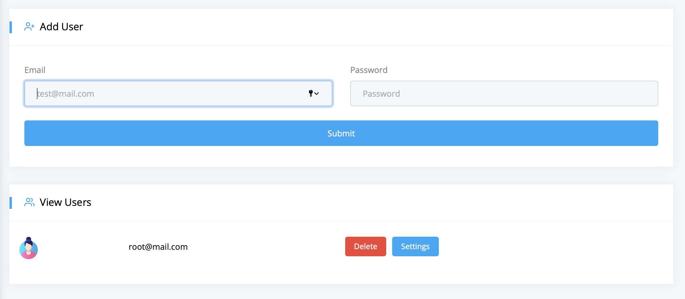
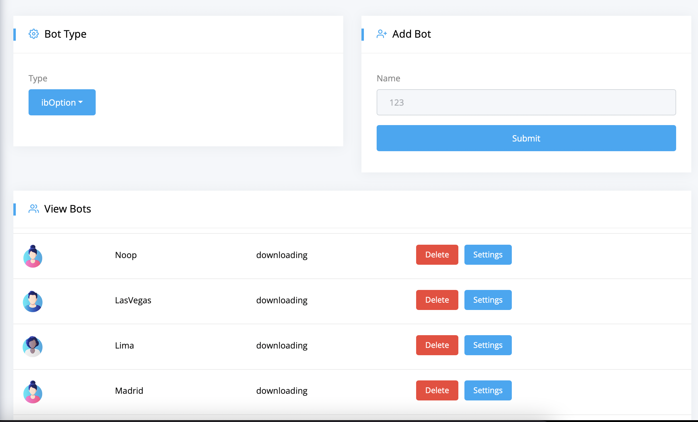
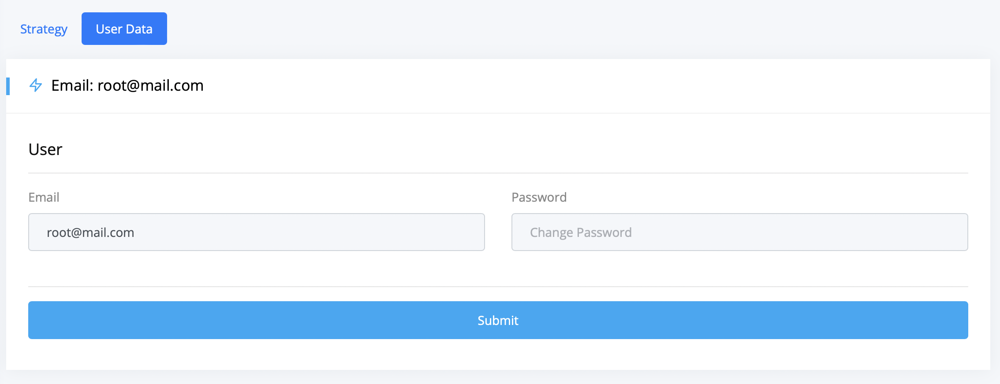
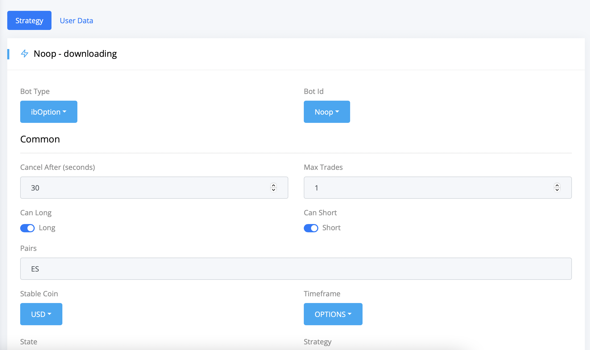
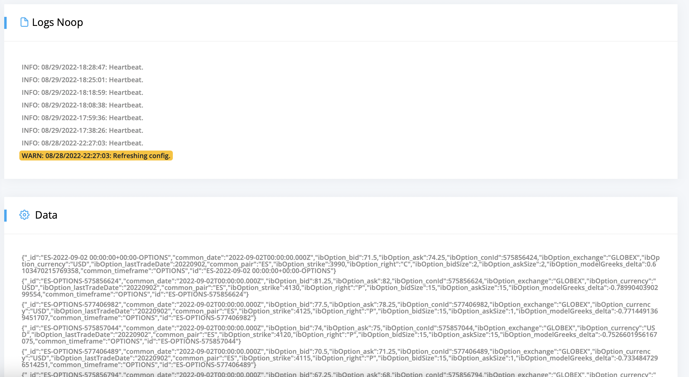
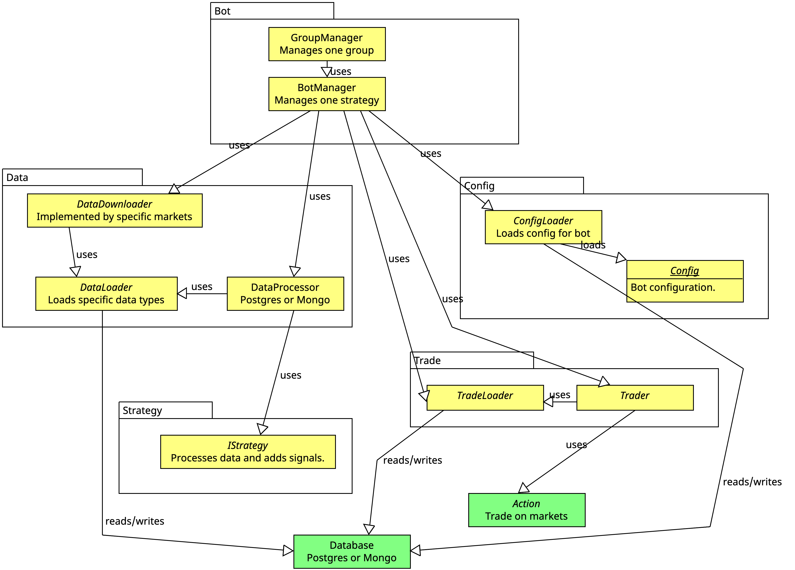
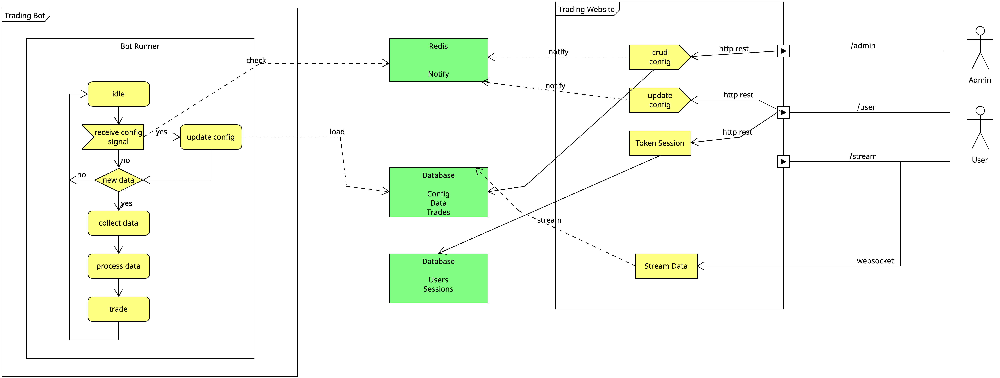
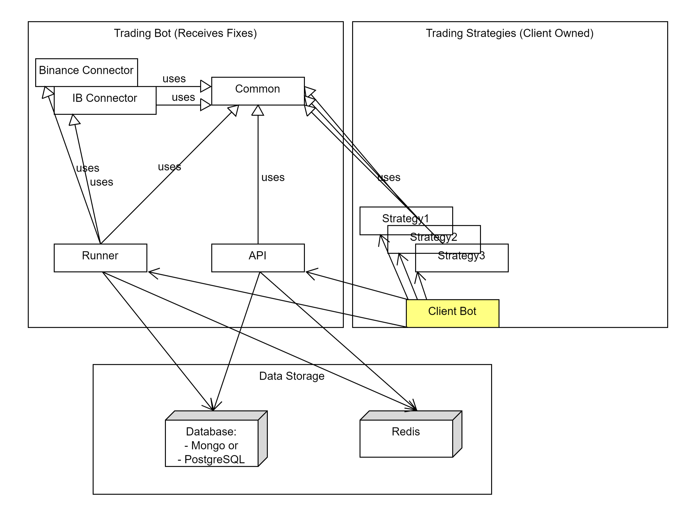

# Trading Bot Description

Documentation:

- [trading-bot-common](https://trading-bot-software.github.io/trading-bot-common-docs/)
- [trading-bot-api](https://trading-bot-software.github.io/trading-bot-api-docs/)
- [trading-bot-ohlc](https://trading-bot-software.github.io/trading-bot-ohlc-docs/)
- [trading-bot-binance](https://trading-bot-software.github.io/trading-bot-binance-docs/)
- [trading-bot-ib](https://trading-bot-software.github.io/trading-bot-ib-docs/)

Development:

- All components have continuous integration with tests and docker deployment. The base of the bot is trading-bot-common, this can be extended with any component as a plugin.

## 1. User Interface


- Login

- Add Users

- Add Bots

- Edit Users

- Edit Bots

- View Logs and Data


## 2. Concepts

This program runs a multitude of bots by grouping them togheter in `bot groups`. Each bot runs a single `strategy`.
Bots can be programmed to have a custom data loader, trade loader and config loader, which write data down to file system and database. You cannot directly change the bot, except changing the database, making it more secure.



The bot is designed to do small simple tasks and each of them can be redone if needed (eg. if computer restarts or network fails). The bot follows simple steps for each strategy, doing everything in loop forever.



The places where the bot writes data to is the database and to files system for caching. Also, it uses redis for notifications on when events happen. Both of these are configurable



### 2.1 Security

The bot itself is built in python and runs in a closed loop, without much access from outside, except from reading configuration data from a database. There is then a website where users can change those pieces of data by changing that database.

This makes the bot secure, as it acts more or less like a black box, without letting anyone interfer with it.

### 2.2 Recovery

After each of its states:
```
idle
downloading
computing
trading
```

The bot writes its state data to the database, so if something happens (a restart, etc), the bot can safely recover.

## 3. Configure

The bot can be configured at start time and at runtime by using environemnt variables and data from database.

### 3.1. Environemnt Variables (Start time configuration)

At start time, the things that don't change during bot execution are configured.

- COMMON_BOT_GROUP - namespace under which bots are grouped. If unsure leave default.
- COMMON_POSTGRE_DB - custom postgres database. Set either this one or the mongodb one.
- COMMON_MONGO_DB and DB - custom mongodb database. Set either this one or the postgres one.
- COMMON_REDIS_HOST - custom redis. Used for async events.

Then, also the bot custom logic is set. Each bot inherits from base configuration and logic, and then it uses custom logic based on different markets or data types.

- COMMON_CONFIG_LOADER_CLASS - Custom config loader class for the bot.

- COMMON_TRADE_ACTIONS_CLASS - Custom trader. This is specific to the market.
- COMMON_TRADE_LOADER_CLASS - Custom trade loader. Adds specific trade data type.
- COMMON_TRADE_PROCESSOR_CLASS - Custom trade processor. Specific to each trade data type.
- COMMON_DATA_LOADER_CLASS - Custom data loader. Adds specific data type.
- COMMON_DATA_DOWNLOADER_CLASS - Custom downloader.
- COMMON_DATA_PROCESSOR_CLASS - Custom data processor.

More environment variables can be defined by extension classes.

### 3.2 Config Table (Runtime configuration)

The bot can be configured at runtime by configuring the config table and then refresh the bot. The bot can be refreshed by notifying it with redis route.
There is also an API webserver that notifies the bot through the redis channel.

These are usually configurations that depend on strategies, data type, cancel time, pairs, etc.

### 3.3 Redis Events

As said above, after the bot's config is changed, in order for the bot to wake up and change the config, the refresh event has to be called.

### 3.4 Bot API

The bot also has a API Webserver which can be used to call the refresh of the bot. Usually it will be deployed alongside the bot.

### 3.5 Trade Table

The bot writes it's trades in the trade table. These properties can be extended by other classes, specified in TRADE_CLASS.


### 3.6 Data Table

The bot writes it's collected raw data in the data table. These properties can be extended by other classes, specified in DATA_CLASS.